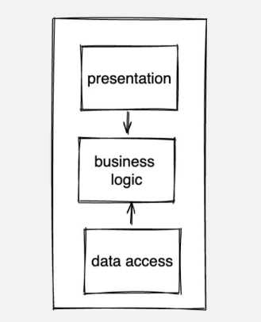
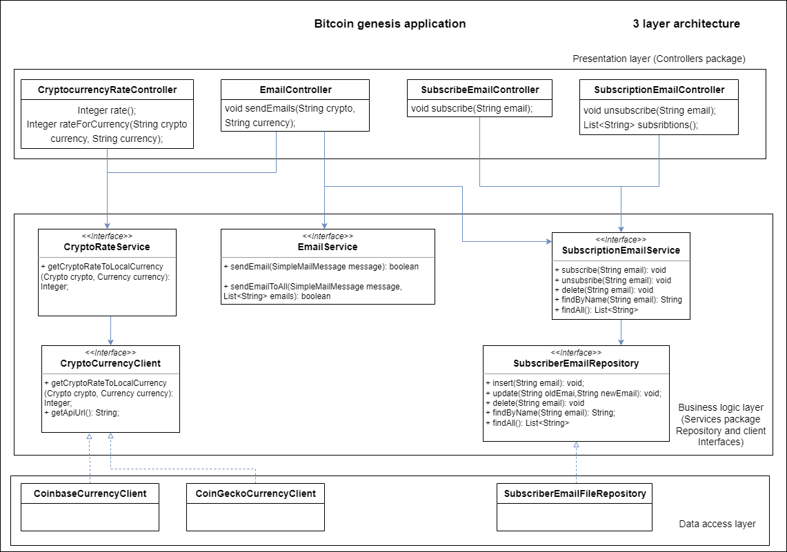

# bitcoin-genesis

To run a project 
1. Add credentials (email username and password) to notification-api
2. docker-compose build
3. docker-compose up

To get all logs from message broker run command - docker-compose up logs.
You also can specify log level in application.properties file in logs-service.

For now, we have two main providers coinbase and coingecko, that you can select via ENV variable in rate-api docker file.
Also, we have exceptional provider - kucoin. If main provider have problems, we will query it.

Caching feature can be enabled or disabled by changing boolean (feature.cache.price.enabled) value in rate-api applicaiton.properites file.

# Architecture
In my application I have 3 layer architecture with Presentation layer, Business logic layer and Data access layer.

Detailed architecture diagram

## Presentation layer
As we can see as presentation layer we have controllers package. In controller, we have mapping to URI,
on which he will respond and methods of controller. Controllers will depend on business logic layer,
namely on business logic interfaces as EmailService, CryptoRateService etc. Methods will have return types,
that will we wrapped in ResponseEntity (class, that helps as to work with http responses)

## Business logic layer
In diagram, I specified only interfaces, but also in this layer we will have all
the implementations of business logic interface services as EmailService, etc. Only Repository and Client
interfaces will be implemented in data access layer. We need this to expand dependency from business layer ->
data access layer to data access layer -> (depends on) business layer.

## Data access layer
Data access layer will have only implementations of how we can get data from data sources as web APIs or
databases etc.

### Remark
In package structure it could seem, that it is not exactly as it is in diagram, because
we see that Repository interface is in package within implementation, but it is only for convenience purposes.
In real flow of application it will work as it presents in diagram.

As I refactored my app to microservices, my project structure was changed, but ,basically,
my architecture on conceptual level was not changed.

I've also created a branch with name - app-as-monolith with source code. In that branch we can see how my project was as monolith.